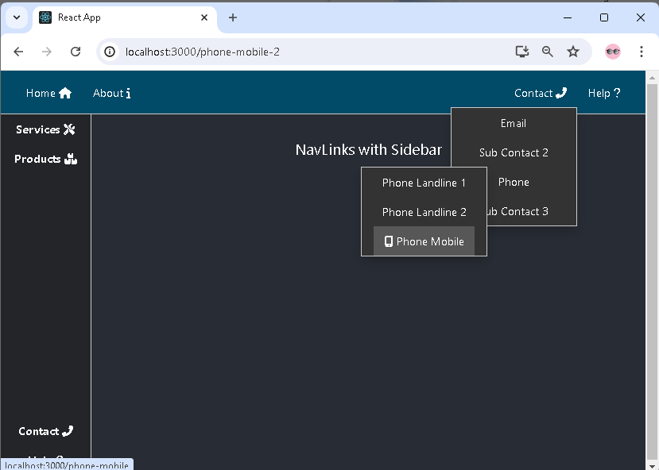
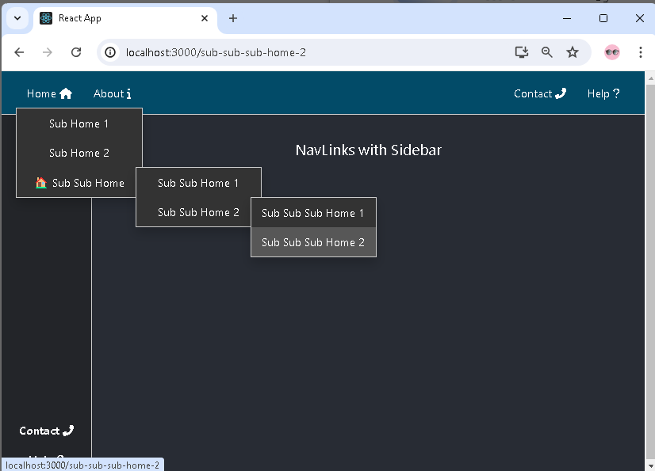

# Dynamic Navigation Links with Dropdowns and Icons for React Apps: `asafarim-navlinks`

`asafarim-navlinks` is a React component for rendering navigation link items, including support for multi-level dropdown menus, icons, and emojis.



## Installation

You can install this package via npm:

```sh
npm install asafarim-navlinks
```

## Usage

Here's how you can use the `asafarim-navlinks` component in your React TypeScript application:

### Step 1: Import the Component

Import the `NavLinks` component into your React application.

```tsx
import React from 'react';
import ReactDOM from 'react-dom';
import NavLinks from 'asafarim-navlinks';
```

### Step 2: Prepare the Links Data

Create an array of link objects that you want to render. Each link can optionally contain sub-navigation items, icons, and emojis.


**src/data.ts:**

```tsx
export const navItems = {
  leftAlignedNavItems: [
    {
      label: "Home",
      href: "/",
      iconRight: "fas fa-home",
      subNav: [
        {
          label: "Sub Home 1",
          href: "/sub-home-1",
          subNav: [
            { label: "Sub Sub Home 1", href: "/sub-sub-home-1" },
            { label: "Sub Sub Home 2", href: "/sub-sub-home-2" },
          ],
        },
        { label: "Sub Home 2", href: "/sub-home-2" },
        {
          label: "Sub Sub Home",
          href: "/sub-sub-home",
          emoji: "🏠",
          subNav: [
            { label: "Sub Sub Home 1", href: "/sub-sub-home-1" },
            {
              label: "Sub Sub Home 2",
              href: "/sub-sub-home-2",
              subNav: [
                { label: "Sub Sub Sub Home 1", href: "/sub-sub-sub-home-1" },
                { label: "Sub Sub Sub Home 2", href: "/sub-sub-sub-home-2" },
              ],
            },
          ],
        },
      ],
    },
    { label: "About", href: "/about", iconRight: "fas fa-info" },
  ],
  middleAlignedNavItems: [
    {
      label: "Services",
      href: "/services",
      iconRight: "fas fa-tools",
      subNav: [
        { label: "Service 1", href: "/service-1" },
        {
          label: "Service 2",
          href: "/service-2",
          subNav: [
            { label: "Sub Service 1", href: "/sub-service-1" },
            { label: "Sub Service 2", href: "/sub-service-2" },
          ],
        },
        {
          label: "Service 3",
          href: "/service-3",
          subNav: [
            { label: "Sub Service 1", href: "/sub-service-1" },
            { label: "Sub Service 2", href: "/sub-service-2" },
          ],
        },
      ],
    },
    { label: "Products", href: "/products", iconRight: "fas fa-boxes" },
  ],
  rightAlignedNavItems: [
    {
      label: "Contact",
      href: "/contact",
      iconRight: "fas fa-phone-alt",
      subNav: [
        { label: "Email", href: "/email" },
        { label: "Sub Contact 2", href: "/sub-contact-2" },
        {
          label: "Phone",
          href: "/phone",
          subNav: [
            { label: "Phone Landline 1", href: "/phone-landline-1" },
            { label: "Phone Landline 2", href: "/phone-landline-2" },
            {
              label: "Phone Mobile",
              href: "/phone-mobile",
              iconLeft: "fas fa-mobile-alt",
              subNav: [
                { label: "Phone Mobile 1", href: "/phone-mobile-1" },
                { label: "Phone Mobile 2", href: "/phone-mobile-2", emoji: "📱" },
              ],
            },
          ],
        },
        { label: "Sub Contact 3", href: "/sub-contact-3" },
      ],
    },
    { label: "Help", href: "/help", iconRight: "fas fa-question" },
  ],
};
```

### Step 3: Render the Component

Use the `NavLinks` component in your JSX and pass the links array as a prop.

**src/App.tsx:**

```tsx
import React from "react";
import NavLinks from "./components/NavLinks";
import { navItems } from "./data";
import styles from "./styles.module.css";

const App: React.FC = () => {
  return (
    <div className={styles.App}>
      <nav className={styles.navContainer}>
        <div className={styles.navLeftAligned}>
          <NavLinks links={navItems.leftAlignedNavItems} />
        </div>
        <div className={styles.navRightAligned}>
          <NavLinks links={navItems.rightAlignedNavItems} isRightAligned={true} />
        </div>
      </nav>
      <main className={styles.mainContainer}>
        <div className={styles.leftSidebar}>
          <div className={styles.sidebarTop}>
            <NavLinks links={navItems.middleAlignedNavItems} />
          </div>
          <div className={styles.sidebarBottom}>
            <NavLinks links={navItems.rightAlignedNavItems} />
          </div>
        </div>
        <div className={styles.contentContainer}>
          <header className={styles.header}>
            NavLinks with Sidebar
          </header>
        </div>
      </main>
    </div>
  );
};

export default App;
```

### Step 4: Styles

Ensure your styles are set up to handle the navigation layout.

**src/styles.module.css:**

```css
.App {
  text-align: center;
  height: 100vh;
  background-color: #282c34;
  color: white;
}

.navLinks {
  margin: 0;
  list-style: none;
  background-color: rgb(2, 75, 104);
  width: 100%;
}

.navLinks > li {
  display: block;
  width: 100%;
  margin-right: 20px;
}

.navContainer {
  display: flex;
  flex-direction: row;
  justify-content: space-between;
  align-items: center;
  padding: 0 20px;
  height: 60px;
  border-bottom: 1px solid #ccc;
  background-color: rgb(2, 75, 104);
}

.navLeftAligned,
.navRightAligned {
  display: flex;
  flex-direction: row;
  align-items: center;
}

.leftSidebar,
.rightSidebar {
  width: 125px;
  border-right: 1px solid #ccc;
  height: calc(100vh - 60px);
  overflow: visible;
  background-color: #232529;
  list-style: none;
  display: flex;
  flex-direction: column;
  align-items: center;
  justify-content: space-between;
}

.sidebarTop,
.sidebarBottom {
  display: flex;
  flex-direction: column;
  align-items: center;
  justify-content: space-around;
  padding: 0;
  color: #a3b956 !important;
  font-weight: bold;
}

.mainContainer {
  display: flex;
  flex-direction: row;
  height: calc(100vh - 60px);
}

.contentContainer {
  flex: 1;
  padding: 20px;
}

.header {
  height: 10vh;
  display: flex;
  flex-direction: column;
  align-items: center;
  justify-content: center;
  font-size: calc(10px + 2vmin);
}
```

### Full Example

Here’s a full example of how to integrate `asafarim-navlinks` into a React TypeScript project, including multi-level dropdown menus, icons, and emojis.

**src/example/index.tsx:**

```tsx
import React from 'react';
import ReactDOM from 'react-dom';
import App from './App';
import './index.css';

ReactDOM.render(<App />, document.getElementById('root'));
```

### Development

To contribute to this package, follow these steps:

1. Clone the repository.
2. Install the dependencies:

   ```sh
   npm install
   ```

3. Make your changes.
4. Build the package:

   ```sh
   npm run build
   ```

5. Publish the package:

   ```sh
   npm publish --access public
   ```

### License

[MIT License](/MIT_License)
