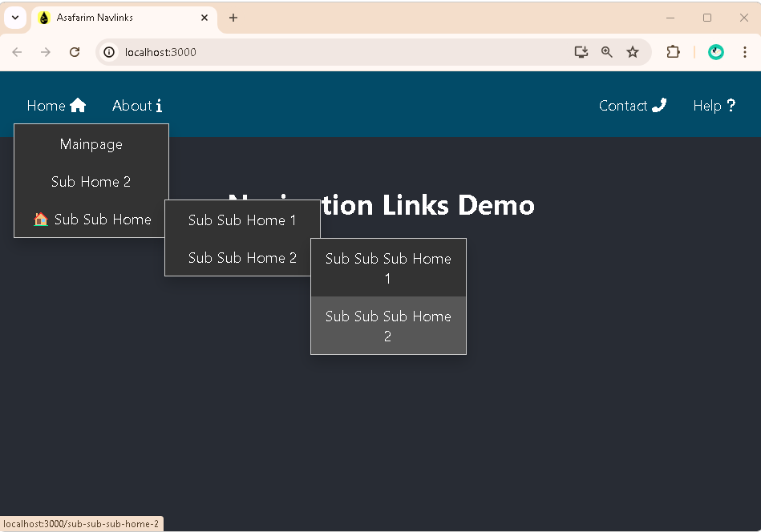

# 🎮 ASafariM NavLinks Interactive Demo

This is a comprehensive demo application showcasing all the features of the `asafarim-navlinks` package. The demo provides real-world examples of navigation implementation including multi-level dropdowns that open on hover, custom styling, and various navigation patterns.



## ✨ Features Demonstrated

- ✅ **Basic Navigation**: Simple, clean navigation links
- ✅ **Unlimited Multi-level Dropdowns**: Deep nesting with proper hover behavior
- ✅ **Icon Support**: Font Awesome icons on left/right sides of menu items
- ✅ **Emoji Support**: Using emojis as visual indicators for modern UI
- ✅ **SVG/Logo Integration**: Custom SVG icons and logos for brand identity
- ✅ **Alignment Options**: Left, right, and bottom aligned navigation for versatile layouts
- ✅ **Custom Styling**: Extensive CSS classes and inline style customization
- ✅ **Responsive Design**: Examples that work on all screen sizes

## 🚀 Running the Demo

### Quick Start

The easiest way to run the demo is using the package script:

```bash
# From the root directory of the package
pnpm run demo
```

This will build the package and start the demo application.

### Manual Setup

1. **Install dependencies**:
   ```bash
   cd demo
   pnpm install
   ```

2. **Build the main package** (if not already built):
   ```bash
   cd ..
   pnpm run build
   ```

3. **Start the demo**:
   ```bash
   cd demo
   pnpm run dev
   ```

4. Open your browser at the URL shown in the terminal (typically [http://localhost:5173](http://localhost:5173)) to view the demo.

### Build for Production

```bash
# From the demo directory
pnpm run build
```

The built demo will be in the `dist` directory and can be served with any static file server.

## 🔍 Demo Structure

The demo is organized into several sections, each showcasing different aspects of the component:

### Main Demo Sections

- **Basic Navigation**: Clean, simple navigation links without any dropdowns
- **Dropdown Navigation**: Multi-level nested navigation menus showing hover behavior
- **Icons & Emojis**: Examples with Font Awesome icons and emoji indicators
- **Advanced Demos**: Complex examples showing deep nesting and mixed content
- **Custom Styling**: Navigation with different visual styles and themes
- **Alignment Options**: Different positioning options (left, right, and bottom aligned)

### Advanced Features Showcase

- **Deep Nesting**: Navigation with 5+ levels of nested dropdowns
- **Mixed Content**: Dropdowns with icons, emojis, and text in various combinations
- **Interactive Elements**: Demonstration of hover states and animations
- **Responsive Behavior**: How the navigation adapts to different screen sizes

### Implementation Examples

Each demo section includes:
- Live interactive example
- Visual preview of the feature
- Source code snippet showing implementation details
- Explanation of the props and options used

## 📋 Demo Navigation Structure

The demo showcases a sophisticated navigation structure with multiple levels:

```typescript
const mainNavigation: NavLinkType[] = [
  // Brand logo with SVG
  {
    label: 'ASafariM',
    href: '/',
    svgLogoIcon: {
      src: '/assets/logoT.svg',
      alt: 'ASafariM Logo',
      width: 35,
      height: 35,
      caption: 'ASafariM',
    }
  },
  
  // Products menu with nested dropdowns
  {
    label: 'Products',
    href: '/products',
    iconLeft: 'fas fa-cube',
    subNav: [
      {
        label: 'Web Development',
        href: '/web-dev',
        emoji: '🌐',
        subNav: [
          { label: 'React Apps', href: '/react-apps', iconLeft: 'fab fa-react' },
          { label: 'Vue Apps', href: '/vue-apps', iconLeft: 'fab fa-vuejs' },
          // More nested items...
        ]
      },
      // More menu items...
    ]
  },
  
  // Advanced demos section with deep nesting
  {
    label: 'Advanced Demos',
    href: '#',
    iconLeft: 'fas fa-flask',
    subNav: [
      {
        label: 'Deep Nesting',
        href: '#deep-nesting',
        subNav: [
          {
            label: 'Level 3',
            href: '#level-3',
            subNav: [
              {
                label: 'Level 4',
                href: '#level-4',
                subNav: [
                  { label: 'Level 5', href: '#level-5' },
                  // Can go deeper...
                ]
              }
            ]
          }
        ]
      }
    ]
  }
]
```

## 🔧 Key Implementation Details

### Multi-level Dropdown Behavior

The demo highlights how dropdowns only appear on hover:

```tsx
// All dropdowns are hidden by default and only appear on hover
// CSS in NavbarLinks.module.css handles the hover behavior
<NavLinks 
  links={advancedNavigation} 
  className="custom-nav"
/>
```

### Custom Styling Applied

The demo shows how to apply custom styling:

```tsx
// Example with custom styling
<NavLinks 
  links={styledNavigation} 
  baseLinkStyle={{
    fontSize: '16px',
    fontWeight: 500,
    padding: '12px 16px',
    color: '#ecf0f1'
  }}
  subLinkStyle={{
    background: 'linear-gradient(135deg, #2c3e50 0%, #34495e 100%)',
    boxShadow: '0 8px 25px rgba(0, 0, 0, 0.3)'
  }}
/>
```

## 🎯 Learning from the Demo

This demo is designed to help you:

1. **Understand the API**: See all props and options in action
2. **Learn patterns**: How to structure complex navigation hierarchies
3. **Explore styling**: Ways to customize the appearance to match your brand
4. **Troubleshoot issues**: Compare your implementation with working examples

## 💻 Development

If you want to modify the demo:

1. Make changes to the source code in the `src` directory
2. Run the development server with `pnpm run dev`
3. Test your changes in the browser

### Project Structure

```
demo/
├── public/          # Static assets
│   └── assets/      # Images, logos, etc.
├── src/             # Source code
│   ├── App.tsx      # Main application component with all examples
│   └── index.css    # Demo-specific styling
├── index.html       # HTML entry point
├── package.json     # Dependencies and scripts
└── vite.config.ts   # Vite configuration
```

## 🙋‍♂️ Feedback & Support

We'd love to hear your feedback on the demo and the package!

- **Issues**: Report bugs or request features [on GitHub](https://github.com/AliSafari-IT/asafarim-navlinks/issues)
- **Questions**: Reach out with questions about implementation
- **Suggestions**: Let us know how we can improve the demo

## 📄 License

This demo is part of the asafarim-navlinks package, licensed under the MIT License.

---

Brought to you by Ali Safari - [@AliSafari-IT](https://github.com/AliSafari-IT)
